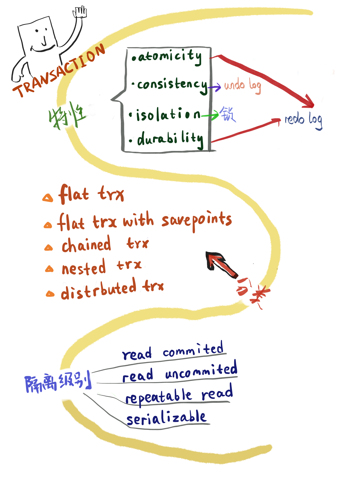
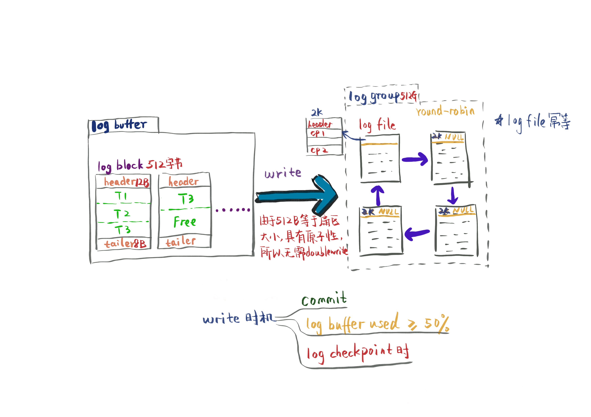
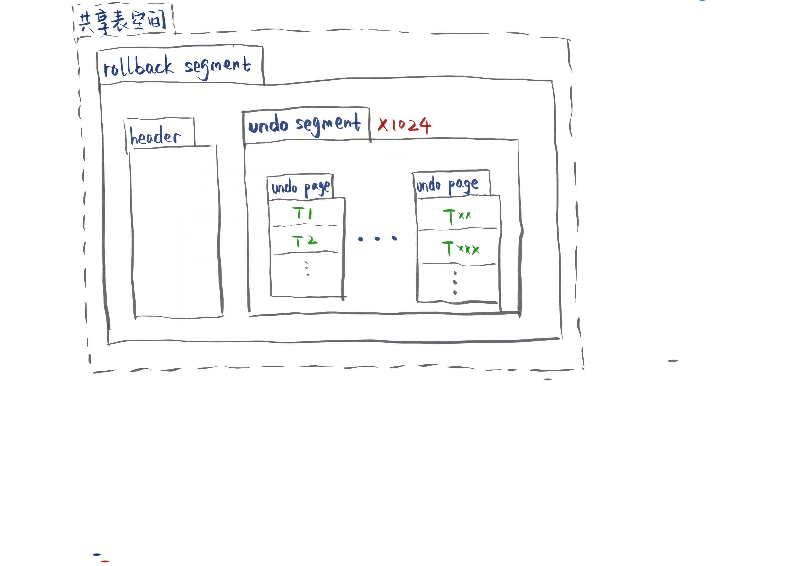
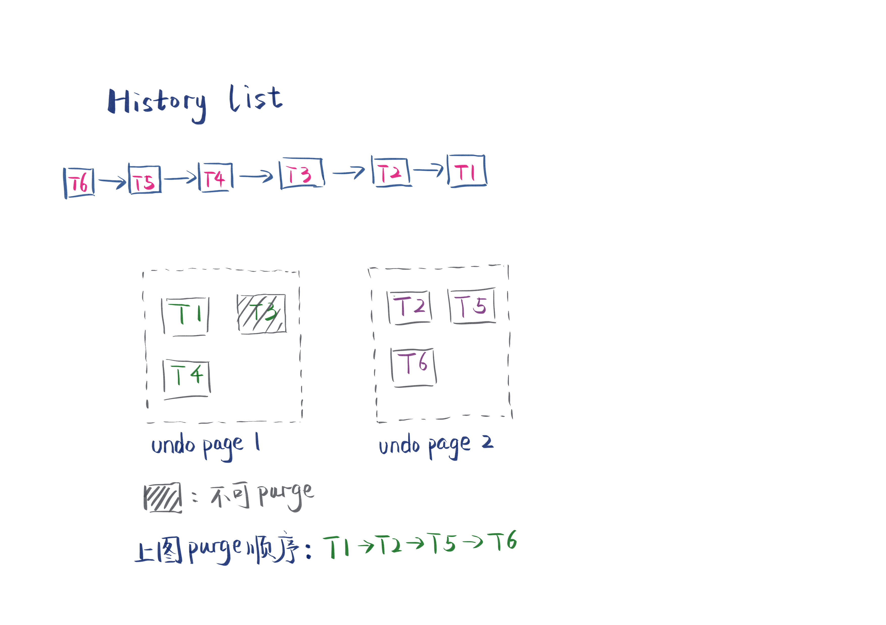
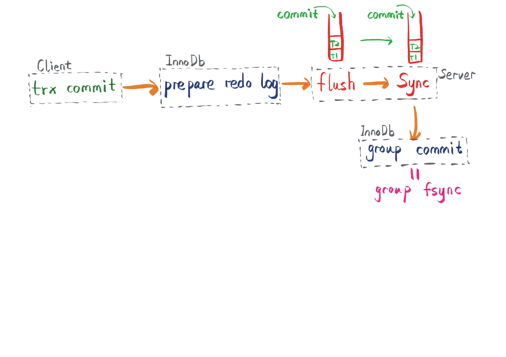
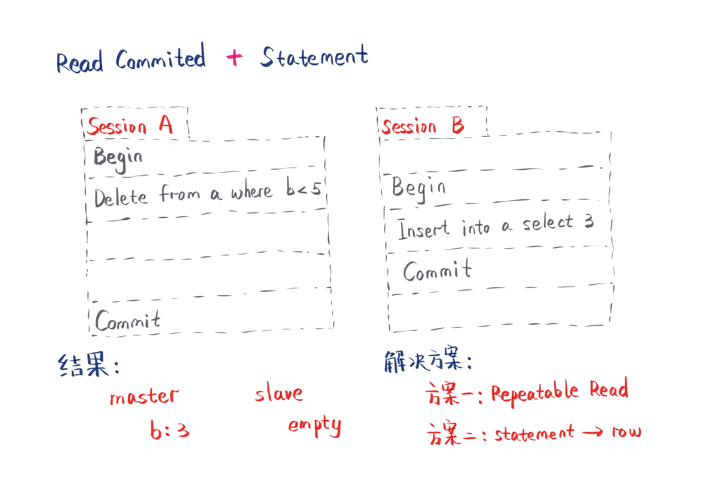

# 事务

> ## 1. 特性 - ACID

- atomicity - [redo log](#redolog)
- consistency - [undo log](#undolog)
- isolation - [锁](锁.md)
- durability - [redo log](#redolog)

> ## 2. 分类

    InnoDB不原生支持nested trx,可以通过 flat trx with savepoints模拟串行nested trx

- flat trx
  - 最常用的事务
  - 整体事务保持原子性，全部提交/回滚
  - begin [work] -> commit [work]/rollback [work]
- flat trx with savepoints
  - begin [work] -> save work 1 -> save work 2 -> save work 3 -> rollback work 2 -> save work 4 -> commit [work]/rollback [work]
  - 可以回滚到任意保存点
  - 保存点递增，即使中间出现rollback wok 2，下一个保存点仍然从save work 4开始
  - rollback work 2 表示回滚到保存点2，如果要进行整个事务回滚，需要再次执行rollback
  - 直到最后commit work，才释放锁
  - 如果服务器宕机，所有保存点都会消失，需要从头开始执行事务
- chained trx
  - 每一个节点都会进行commit，并且释放锁
  - 上一个节点commit后，会带着上下文开启下一个节点的事务
  - 服务器宕机，已执行的事务不需要重复执行
- nested trx
  - 事务树
  - 叶子结点一定是flat trx
  - 所有事务的commit都只是临时性commit，要等顶层事务提交之后才会真正被提交
  - 任何事务的回滚都会使所有子事务回滚
  - 在Moss理论中，只有叶子结点才真正执行业务逻辑，其他节点只负责逻辑调度
  - 树中的事务支持串行和并行执行
  - 可以使用flat trx with savepoints 模拟 串行 nested trx
- distibuted trx
  - 处理不同节点的事务
  - 具有原子性
  - 典型案例：银行转帐

> ## <a id="redolog"> 3. redo log </a>

> ## <a id="undolog"> 4. undo log </a>

- undo的写入会产生redo log，因为这个过程也需要持久化
- undo类型：
  - insert
    - commit后会自动删除（因为事务的隔离性，因此可以直接删除，不需要等待purge）
  - update
    - commit后不会立刻删除
    - update非主键时产生此状态
    - update主键时第二步产生此状态
  - mark-delete
    - commit后不会立刻删除
    - update主键时第一步产生
    - delete操作产生
  - delete
    - [purge](#purge)使用

> ## <a id="purge"> 5. purge </a>

- 删除delete和update产生的undo log
- 已页为单位进行purge，可配置每次purge的页数
- 从history list中选取链表最后一个节点进行purge，同时顺序purge他所在页的其他节点，如果遇到节点不能purge，则回到history list寻找下一个要purge的节点
- history list的最大长度可配置，超过则会delay DML操作
- delay DML操作已行为单位，一个事务如果操作多行，则delay的时间为delay * n
- 最长delay时间可配置，超过则默认使用最长delay时间

> ## 6. group commit

- binlog 使innoDB的group commit策略失效
- 解决方案如下图

> ## 7. 隔离级别

- 默认Repeatable Read
- 在 Read Commited + Statement 下，主从会出现不一致，如下图：

