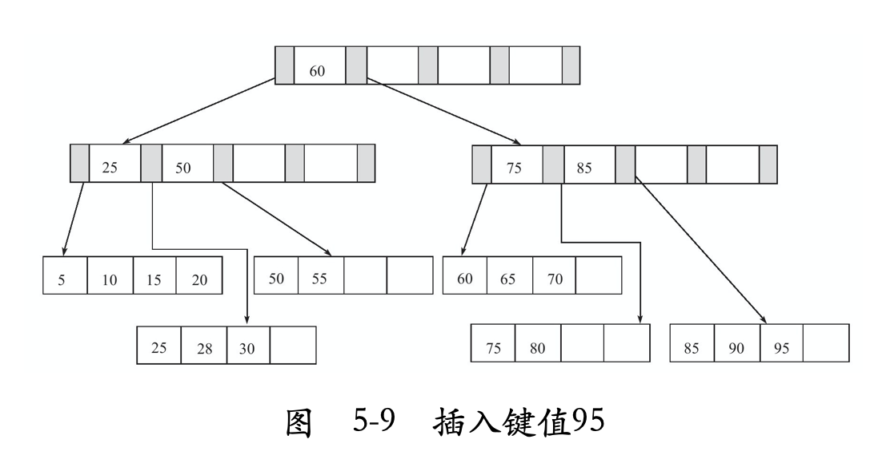
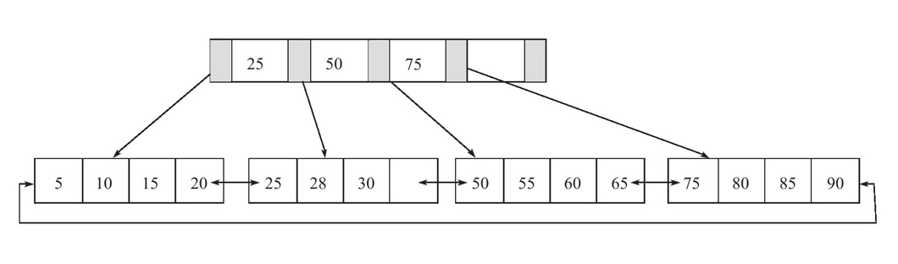
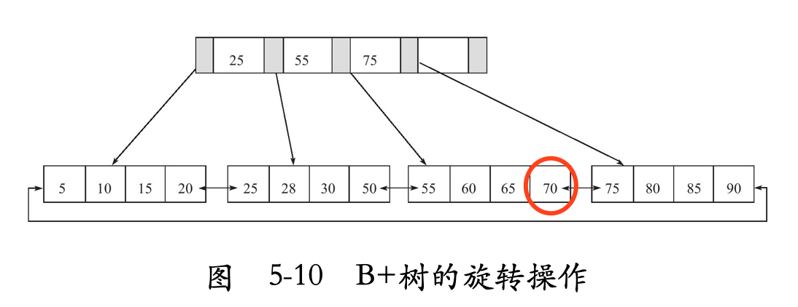
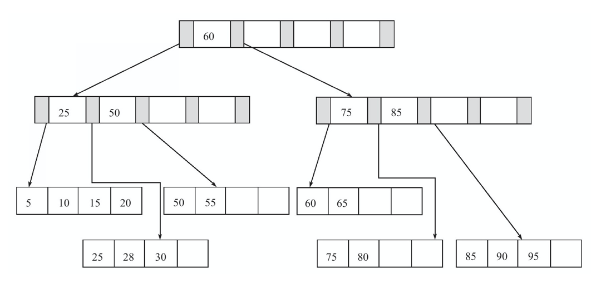
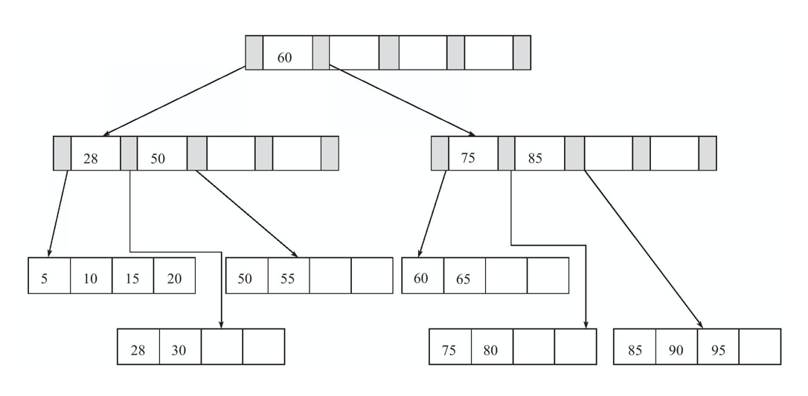
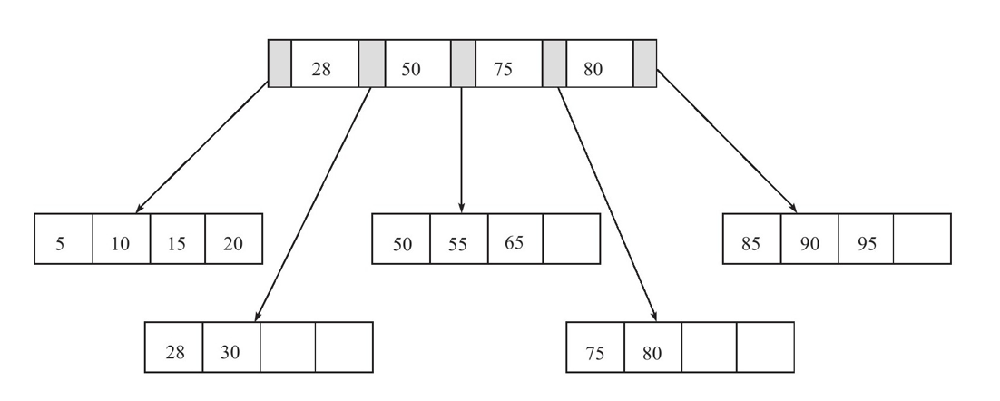

# B+树索引

> ## 1. B+树

- 是一个平衡查找树，具有高度平衡性

- 所有记录的节点键值按照从小到大排列

- 叶子结点之间是一个双向链表

> ## 2. 插入

插入后的树仍然是排序的

Leaf Page Full | Index Page Full | Options
:---:|:---:|:---
No | No | 直接插入到Leaf结点
Yes | No | 拆分Leaf结点，将中间的值升级到Index Page, 左边Leaf结点放比中间值小的节点，右边Leaf结点存放中间值和比中间值大的节点，然后在将新结点插入
Yes | Yes | 先按照上述步骤拆分Leaf节点，然后再按照上述步骤拆分Index节点，但是对于Index的中间节点，直接拆到上层Index Page中，不需要再重复放到下层Index Page

下图中展示了Leaf和Index Page全满的情况下，插入“95”的变化：

> 注意

    - Index Page中的“60”裂变后，只存在于一个Index Page中

    - Leaf Page中的节点裂变到Index Page后，也会同时存在于Leaf Page中，比如图中的“60”

> ## 3. 旋转

B+树为了减少页拆分操作，提供了旋转（Rotation）功能，即如果Leaf已满，但是左右兄弟页中有空余，则会进行旋转，不会急着做拆分

> ## 4. 删除

B+树使用填充因子(fill factor, 下面用FF代替)来控制树的删除，填充因子的最小值为50%

Leaf < FF | Index < FF | Options
:---:|:---:|:---
No | No | 删除Leaf的值，如果这个值还在Index Page中，则用当前值的右值替代
Yes | No | 删除Leaf后，将Leaf与兄弟节点做合并，如果这个值还在Index Page中，Index Page如果小于FF，也许要做合并，否则右值代替
Yes | Yes | 删除Leaf，然后合并Leaf和兄弟节点，再对Index Page进行合并

> 情况一

> 情况二和三

